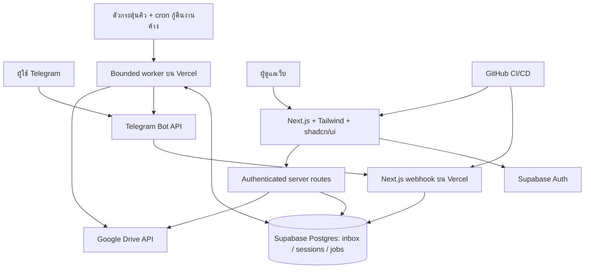

# Telegram Bot → Google Drive Photo Manager
## เอกสารออกแบบระบบฉบับละเอียด v2

วันที่จัดทำ: 29 กันยายน 2569 (2026-09-29)  
ภาษา: ไทย · สถานะ: ข้อกำหนดและแบบออกแบบสำหรับนำไปพัฒนา ยังไม่ใช่ระบบที่ติดตั้งแล้ว

เอกสารนี้รวบรวมข้อกำหนดล่าสุดจากบทสนทนา “ออกแบบระบบเซฟรูป Telegram” และแทนที่แนวคิดเดิมเรื่องการผูกสิทธิ์ Telegram user กับโฟลเดอร์ชื่อบุคคลแบบตายตัว หากข้อความเก่าขัดกับเอกสารนี้ ให้ยึดข้อกำหนดฉบับนี้ ข้อกำหนดด้านพฤติกรรมหลักถือเป็นข้อสรุป ส่วนค่า limit, อายุ session และนโยบายดูแลระบบที่ระบุว่า “ค่าเริ่มต้นเสนอ” สามารถปรับระหว่างพัฒนาได้

## สารบัญ

1. [เป้าหมายและกฎหลัก](#1-เป้าหมายและกฎหลัก)
2. [ขอบเขตและคำจำกัดความ](#2-ขอบเขตและคำจำกัดความ)
3. [โครงสร้าง Google Drive](#3-โครงสร้าง-google-drive)
4. [ประสบการณ์ใช้งาน Telegram](#4-ประสบการณ์ใช้งาน-telegram)
5. [ชุดรูปและวงจร session](#5-ชุดรูปและวงจร-session)
6. [วันที่ ชื่อโฟลเดอร์ และชื่อไฟล์](#6-วันที่-ชื่อโฟลเดอร์-และชื่อไฟล์)
7. [สถาปัตยกรรม](#7-สถาปัตยกรรม)
8. [ฐานข้อมูล](#8-ฐานข้อมูล)
9. [State machine และ Callback](#9-state-machine-และ-callback)
10. [การประมวลผลและป้องกันข้อมูลซ้ำ](#10-การประมวลผลและป้องกันข้อมูลซ้ำ)
11. [API routes](#11-api-routes)
12. [Dashboard](#12-dashboard)
13. [Security และ RLS](#13-security-และ-rls)
14. [โครงสร้างโปรเจกต์](#14-โครงสร้างโปรเจกต์)
15. [Environment variables](#15-environment-variables)
16. [Deployment และการดูแลระบบ](#16-deployment-และการดูแลระบบ)
17. [แผนทดสอบ](#17-แผนทดสอบ)
18. [Definition of Done](#18-definition-of-done)
19. [การพัฒนาต่อ](#19-การพัฒนาต่อ)
20. [แหล่งอ้างอิง](#20-แหล่งอ้างอิง)

## 1. เป้าหมายและกฎหลัก

ให้ผู้ใช้ส่งรูปเข้า Telegram ก่อน แล้ว Bot ช่วยเลือกปลายทาง กรอกข้อมูลงาน ตรวจสอบ และบันทึกรูปทั้งหมดลง Google Drive พร้อม Dashboard สำหรับค้นหาและติดตามผล

| รหัส | ข้อกำหนดที่ต้องรักษา |
|---|---|
| R01 | รับรูปก่อน แล้วจึงถามว่าจะจัดเก็บภายใต้โฟลเดอร์ชื่อใด |
| R02 | ครั้งแรกเลือกชื่อ เช่น นุ๊ก/สมชาย/ชื่ออื่น หรือสร้างชื่อใหม่ได้ |
| R03 | จดจำ Telegram user ID, username และ user folder ที่เลือกล่าสุดใน Supabase |
| R04 | ความจำนี้เป็น preference เท่านั้น ไม่ใช่สิทธิ์หรือความเป็นเจ้าของโฟลเดอร์ |
| R05 | ทุกครั้งยังเลือกชื่ออื่นหรือสร้างชื่อใหม่ได้ ไม่บังคับใช้ค่าล่าสุด |
| R06 | ทั้ง “รายการสาขาซื้อ เมาส์ + คีย์บอร์ด” และ “เครื่องสำรองไฟ” มี CCTV และ QUARK |
| R07 | 1 upload session ที่ยืนยัน = 1 โฟลเดอร์งานใหม่; retry ของ session เดิมใช้โฟลเดอร์เดิม |
| R08 | ห้ามเสนอการนำ session ใหม่ไปเติมในโฟลเดอร์งานเก่า แม้ชื่อ/สาขา/วันที่ตรงกัน |
| R09 | วันที่ในชื่องานคือ work date ที่ผู้ใช้เลือกหรือกรอก ห้ามอนุมานจากเวลาส่งรูป |
| R10 | ใช้ Inline Keyboard ประมาณ 80–90% ของขั้นตอนมาตรฐาน; พิมพ์เมื่อข้อมูลยังไม่มีตัวเลือก |
| R11 | มี วันนี้/เมื่อวาน/ระบุเอง, ย้อนกลับ, แก้ไข, ยกเลิก และยืนยัน |
| R12 | แสดง preview ของ path, ชื่อโฟลเดอร์, วันที่ และจำนวนรูปก่อนสร้างสิ่งใดใน Drive |

คำว่า “โฟลเดอร์ผู้ใช้” หมายถึงโฟลเดอร์ชื่อบุคคลสำหรับจัดหมวดหมู่ ไม่ใช่บัญชีล็อกอิน และไม่ใช่ ACL ผู้ส่งคนเดียวสามารถเลือกโฟลเดอร์ของชื่ออื่นในแต่ละงานได้

## 2. ขอบเขตและคำจำกัดความ

### 2.1 ขอบเขต MVP

- Telegram private chat เป็นช่องทางเริ่มต้น และรองรับกลุ่มที่ลงทะเบียนเมื่อผ่านการทดสอบการรับข้อความแล้ว
- รับ Telegram photo และ document ที่ตรวจสอบแล้วว่าเป็นรูปภาพตามชนิดที่รองรับ
- เลือก/สร้างโฟลเดอร์ชื่อบุคคล เลือกประเภทงาน ระบบ สาขา รายละเอียด และวันที่
- สร้างโครงสร้างมาตรฐานให้ชื่อใหม่ครบทั้งสองประเภทงานและสองระบบหลังยืนยัน
- อัปโหลดแบบมีคิวถาวร ติดตามสถานะรายไฟล์ และ retry ได้
- Dashboard ใช้ Supabase Auth สำหรับผู้ดูแล ค้นหางาน เปิดลิงก์ Drive และตรวจสอบงานผิดพลาด
- Google Drive เก็บรูปจริง; Supabase เก็บ metadata, preference, state และประวัติ

### 2.2 คำจำกัดความ

| คำ | ความหมาย |
|---|---|
| Telegram user | ผู้ส่งที่ระบุด้วย numeric user ID; username เปลี่ยนได้และอาจไม่มี |
| User folder | โฟลเดอร์ชื่อบุคคลใต้ “งาน IT” ที่ทุกผู้ใช้ Bot ในขอบเขตระบบเลือกได้ |
| Upload session | ชุดรูปและข้อมูลงานหนึ่งชุดที่ผู้ใช้ยืนยันร่วมกัน |
| Media group | อัลบั้มจาก Telegram; หนึ่ง session อาจมีหลายอัลบั้มหรือรูปเดี่ยว |
| Work folder | โฟลเดอร์งานใหม่ที่สร้างเฉพาะ session นั้น |
| Work date | วันที่ของงาน/วันที่ซื้อที่ผู้ใช้ยืนยัน ไม่ใช่ received_at หรือ uploaded_at |
| Actor | ผู้ดำเนินการจริง เก็บเพื่อ audit แม้เลือกโฟลเดอร์ชื่อคนอื่น |
| Canonical ID | Drive folder/file ID ที่ระบบใช้อ้างอิงจริง ชื่อใช้เพื่อแสดงผล |

### 2.3 ข้อตัดสินใจเริ่มต้น

- ระบบหนึ่งชุดมี root “งาน IT” หนึ่งแห่ง; schema เตรียม workspace ไว้แยกข้อมูลในอนาคต
- ไม่ต้องให้ผู้ใช้ Telegram สมัคร Supabase Auth เพื่อส่งรูป
- Dashboard MVP ให้เฉพาะสมาชิกที่เชิญเข้า workspace ไม่เปิดลงทะเบียนแล้วเห็นข้อมูลทันที
- ค่าเริ่มต้นเสนอ: session รับได้ 50 รูป อายุ draft 24 ชั่วโมง; จำนวนนี้ไม่ใช่ข้อจำกัด Telegram
- ไม่ลบรูปหรือโฟลเดอร์ Drive อัตโนมัติเมื่อเกิดข้อผิดพลาด
- การเปลี่ยนชื่อที่เลือก หมายถึงเปลี่ยนปลายทางของ session; การ rename โฟลเดอร์จริงเป็นงานผู้ดูแลแยกต่างหาก

## 3. โครงสร้าง Google Drive

```text
งาน IT/                                      ← root ที่กำหนดด้วย Drive ID
├── นุ๊ก/
│   ├── รายการสาขาซื้อ เมาส์ + คีย์บอร์ด/
│   │   ├── CCTV/
│   │   │   └── สาขา BCP - เมาส์ ค.กลางคืน ซื้อเมื่อ 29.8.69 [S-001234]/
│   │   │       ├── 20260829_BCP_MOUSE_KEYBOARD_CCTV_S001234_001.jpg
│   │   │       └── 20260829_BCP_MOUSE_KEYBOARD_CCTV_S001234_002.jpg
│   │   └── QUARK/
│   │       └── สาขา SEE - คีย์บอร์ด คอม Q1 ซื้อเมื่อ 29.8.69 [S-001235]/
│   │           └── 20260829_SEE_MOUSE_KEYBOARD_QUARK_S001235_001.png
│   └── เครื่องสำรองไฟ/
│       ├── CCTV/
│       │   └── เครื่องสำรองไฟ สาขา RAM 24.9.69 [S-001236]/
│       │       ├── 20260924_RAM_UPS_CCTV_S001236_001.jpg
│       │       └── 20260924_RAM_UPS_CCTV_S001236_002.jpg
│       └── QUARK/
├── สมชาย/
│   ├── รายการสาขาซื้อ เมาส์ + คีย์บอร์ด/
│   │   ├── CCTV/
│   │   └── QUARK/
│   └── เครื่องสำรองไฟ/
│       ├── CCTV/
│       └── QUARK/
└── [ชื่ออื่น]/
    ├── รายการสาขาซื้อ เมาส์ + คีย์บอร์ด/
    │   ├── CCTV/
    │   └── QUARK/
    └── เครื่องสำรองไฟ/
        ├── CCTV/
        └── QUARK/
```

### 3.1 กฎการสร้าง

1. ใช้ `GOOGLE_DRIVE_ROOT_FOLDER_ID` ตั้งต้น ตรวจว่าเป็นโฟลเดอร์และมีสิทธิ์เขียน
2. User folder และโฟลเดอร์ประเภทงาน/ระบบใช้ซ้ำได้ตาม canonical ID
3. Work folder ใช้ซ้ำได้เฉพาะการประมวลผล session เดิมเท่านั้น
4. คนเดียว ส่งสาขาเดิม วันที่เดิมสอง session ต้องได้ work folder คนละ ID
5. ไม่ค้นหา work folder จากชื่อแล้วนำมาใช้กับ session ใหม่
6. ชื่อใหม่เป็น draft ในฐานข้อมูลก่อน เมื่อผู้ใช้กดยืนยันจึงสร้าง Drive hierarchy
7. หากชื่อบุคคลมีอยู่แล้ว แสดงให้เลือกชื่อเดิมแทนสร้างรายการซ้ำ; ไม่อ้างชื่อเป็นหลักฐานสิทธิ์

### 3.2 Folder ID เป็นข้อมูลหลัก

- บันทึก parent ID, Drive ID, workspace และชนิด node ทุกระดับ
- Rename ใน Drive ไม่เปลี่ยนตัวตนของโฟลเดอร์; sync ชื่อแสดงผลได้
- ตรวจ `trashed`, MIME type และ ancestry ให้อยู่ใต้ root ที่อนุญาตก่อนใช้
- ถ้าโฟลเดอร์ถูกย้ายออกนอก root ให้หยุดงานและให้ผู้ดูแลแก้ mapping ห้ามตามไปเขียนนอกขอบเขต
- ถ้า root/subfolder ถูกลบหรือมีชื่อซ้ำหลายรายการ ให้แสดงสถานะต้องตรวจสอบ ห้ามเลือกตัวแรกจากผลค้นหา
- งานนำเข้าโครงสร้างเดิมให้ผู้ดูแลเลือก canonical folder ID ชัดเจน และเก็บ audit

## 4. ประสบการณ์ใช้งาน Telegram

### 4.1 รับรูปและปิดชุดรูป

เมื่อได้รับรูปแรก Bot เปิด session และตอบทันทีด้วยข้อความรับรูป พร้อมตัวเลือกโฟลเดอร์ ส่วนจำนวนรูปอัปเดตแบบ debounce เพื่อลดข้อความรบกวน ผู้ใช้เลือกข้อมูลขณะทยอยส่งรูปได้ แต่ต้องกด “ส่งครบแล้ว” ก่อน preview และ confirm

```text
📷 รับแล้ว 3 รูป — ส่งเพิ่มในชุดนี้ได้
เลือกโฟลเดอร์ชื่อผู้ใช้
[ 👤 นุ๊ก ] [ 👤 สมชาย ]
[ 👥 ชื่ออื่น / หน้าถัดไป ]
[ ➕ สร้างชื่อใหม่ ]
[ ✅ ส่งครบแล้ว ] [ ❌ ยกเลิกชุดนี้ ]
```

ชื่อจำนวนมากใช้ pagination 6–8 รายการต่อหน้า และปุ่มค้นหาที่ให้พิมพ์ชื่อ รายชื่อที่เคยใช้แสดงก่อนโดยไม่ซ่อนชื่ออื่น

### 4.2 ครั้งถัดไป

```text
📷 รับแล้ว 2 รูป
โฟลเดอร์ที่เลือกล่าสุด: นุ๊ก
[ ✅ ใช้ “นุ๊ก” ]
[ 👥 เลือกชื่ออื่น ] [ ➕ สร้างชื่อใหม่ ]
```

Bot ต้องรอให้กดเลือก ไม่ข้ามขั้นหรือบันทึกลงชื่อเดิมเอง อัปเดต username/display name ทุกครั้งที่รับ update ที่เชื่อถือได้ ใช้ user ID เป็น key หลักเสมอ

### 4.3 สร้างชื่อใหม่

```text
กรุณาพิมพ์ชื่อโฟลเดอร์ เช่น ต้น
[ ◀️ ย้อนกลับ ] [ ❌ ยกเลิก ]
```

ตรวจชื่อว่าง อักขระควบคุม ความยาว และชื่อซ้ำหลัง trim/normalize หากซ้ำให้เสนอรายการที่มีอยู่แล้ว ถ้ายังไม่มีให้บันทึก `pending_user_folder_name` และแสดง “จะสร้างหลังยืนยัน” ไม่สร้าง Drive folder ระหว่างกรอก

### 4.4 ประเภทงานและระบบ

```text
เลือกประเภทงาน
[ 🖱️ รายการสาขาซื้อ เมาส์ + คีย์บอร์ด ]
[ 🔋 เครื่องสำรองไฟ ]
[ ◀️ ย้อนกลับ ] [ ❌ ยกเลิก ]

เลือกประเภทระบบ
[ 📹 CCTV ] [ 🖥️ QUARK ]
[ ◀️ ย้อนกลับ ] [ ❌ ยกเลิก ]
```

### 4.5 สาขาและรายละเอียด

- ถ้ามี master สาขา ให้เลือกด้วยปุ่ม/ค้นหา เช่น BCP, SEE, RAM พร้อม “สาขาอื่น”
- หากยังไม่มี master ให้พิมพ์สาขา โดย Bot ไม่สร้าง master ถาวรจากข้อความอิสระทันที
- งานเมาส์/คีย์บอร์ด: เลือก เมาส์/คีย์บอร์ด/ทั้งสอง/อื่น แล้วระบุเครื่องหรือจุดใช้งาน เช่น “ค.กลางคืน” หรือ “คอม Q1”
- งาน UPS: สาขาเป็นข้อมูลบังคับ รายละเอียดเครื่อง/จุดติดตั้งเป็นข้อมูลเสริม มีปุ่ม “ข้ามรายละเอียด”
- ข้อความ caption ใช้เสนอรายละเอียดได้ แต่ไม่ถือเป็นคำยืนยันข้อมูลหรือวันที่
- เป้าหมาย 80–90% เป็นสัดส่วนการโต้ตอบใน flow ปกติที่มี master พร้อม ไม่บังคับให้ข้อมูลอิสระกลายเป็นปุ่มที่ใช้งานยาก

### 4.6 เลือกวันที่

```text
📅 วันที่ของงาน
[ วันนี้ 29.9.69 ] [ เมื่อวาน 28.9.69 ]
[ ✏️ ระบุวันที่เอง ]
[ ◀️ ย้อนกลับ ] [ ❌ ยกเลิก ]
```

ค่าของปุ่มต้องผูกกับวันที่จริงตอนสร้างปุ่ม ไม่คำนวณใหม่เมื่อกดหลังเที่ยงคืน หากเมนูค้างข้ามวัน ให้แสดงวันที่นั้นชัดเจนหรือ refresh เมนูและให้เลือกใหม่

### 4.7 Preview ก่อนสร้าง

```text
📋 ตรวจสอบก่อนบันทึก
ผู้ส่ง: @user123
โฟลเดอร์ชื่อ: นุ๊ก
งาน: เครื่องสำรองไฟ / CCTV
สาขา: RAM
วันที่งาน: 24 กันยายน 2569 (2026-09-24)
รูปทั้งหมด: 3 รูป

งาน IT
└── นุ๊ก
    └── เครื่องสำรองไฟ
        └── CCTV
            └── 🆕 เครื่องสำรองไฟ สาขา RAM 24.9.69 [S-001236]

[ ✅ สร้างโฟลเดอร์และอัปโหลด ]
[ ✏️ แก้ไข ] [ ◀️ ย้อนกลับ ] [ ❌ ยกเลิก ]
```

Preview ต้องแสดงชื่อจริงที่จะสร้าง รวม suffix ของ session และแจ้งโฟลเดอร์ชั้นอื่นที่จำเป็นต้องสร้างด้วย ปุ่มแก้ไขเลือกแก้ ชื่อบุคคล/ประเภทงาน/ระบบ/สาขา/รายละเอียด/วันที่/ชุดรูป แล้วกลับมา preview ใหม่

### 4.8 หลังยืนยัน

```text
⏳ รับงาน S-001236 แล้ว กำลังบันทึก 3 รูป

✅ บันทึกสำเร็จ 3/3 รูป
📁 เครื่องสำรองไฟ สาขา RAM 24.9.69 [S-001236]
[ เปิดโฟลเดอร์ Google Drive ] [ เริ่มชุดใหม่ ]
```

หากสำเร็จบางส่วน แสดง “สำเร็จ 2/3 รูป” พร้อมปุ่ม “ลองใหม่เฉพาะรูปที่ยังไม่สำเร็จ” ห้ามรายงานว่าสำเร็จทั้งหมดก่อนตรวจครบ การเปิดลิงก์ Drive ยังขึ้นกับสิทธิ์ Google Drive ของผู้เปิด ระบบไม่เปิดแชร์สาธารณะให้อัตโนมัติ

## 5. ชุดรูปและวงจร session

### 5.1 การแบ่ง session

- Key ของ draft context คือ `(bot_id, chat_id, message_thread_id หรือ 0, telegram_user_id)`
- อนุญาต draft ที่แก้ไขได้หนึ่งรายการต่อ context; งานเก่าที่กำลังอัปโหลดไม่ขวาง draft ชุดใหม่
- เก็บ `media_group_id` แต่ไม่ถือว่าได้รับครบหลังเงียบไม่กี่วินาที เพราะ update อาจมาช้า/ผิดลำดับ
- ปุ่ม “ส่งครบแล้ว” ปิดรับชุดรูปเพื่อเข้าสู่ preview; debounce ใช้ปรับจำนวนที่แสดงเท่านั้น
- รูปใหม่ก่อน confirm ทำให้ preview เก่าหมดอายุ เพิ่ม revision และให้ตรวจจำนวนใหม่
- รูปใหม่หลัง confirm ไม่เพิ่มเข้า snapshot เดิม: ถ้าไม่ใช่อัลบั้มเดิมให้เปิด draft ใหม่; ถ้าเป็น update มาช้าของอัลบั้มที่ปิดแล้ว ให้แจ้งว่ามีรูปเพิ่มเติมและเสนอจัดเป็นชุดใหม่โดยไม่อัปโหลดเอง
- ข้อความ reply/command ที่อ้าง session เก่าต้องตรวจสถานะก่อนนำรูปไปผูก ป้องกันรูปหลุดไปอยู่ชุดใหม่โดยไม่ตั้งใจ
- เก็บลำดับตาม message ID ภายใน chat แล้วกำหนดเลขไฟล์คงที่ตอน confirm

### 5.2 กลุ่ม Telegram

- แยก session ต่อผู้ส่ง แม้ส่งพร้อมกันในกลุ่ม/topic เดียวกัน
- ผู้กดปุ่มต้องเป็นเจ้าของ session; คนอื่นเห็นปุ่มได้แต่กดเปลี่ยนงานไม่ได้
- ใช้ reply-to prompt/ForceReply สำหรับข้อความชื่อใหม่และรายละเอียด เพื่อให้แยกบทสนทนาได้
- Anonymous admin หรือข้อความที่ไม่มี user identity ที่รองรับ ให้แนะนำทำผ่าน private chat
- ตรวจ privacy mode และสิทธิ์ Bot ในกลุ่มจริง หากต้องรับรูปทั่วไปโดยไม่ mention ต้องตั้งค่าการรับข้อความให้เหมาะสมกับ Telegram แล้วทดสอบก่อนเปิดใช้
- การเป็นเจ้าของ session ป้องกันการแก้ชุดรูปของคนอื่น ไม่ใช่การล็อก user-folder

### 5.3 ยกเลิกและหมดอายุ

- ก่อน confirm: ยกเลิกได้ทันที ปิดปุ่ม ล้าง pending input และไม่มีการสร้างข้อมูลใน Drive
- Draft ไม่ใช้งานเกิน 24 ชั่วโมงตามค่าเริ่มต้นเสนอ: เปลี่ยนเป็น expired แจ้งให้เริ่มใหม่
- หลัง confirm: ปุ่ม cancel เปลี่ยนเป็น “หยุดงานที่เหลือ” worker หยุดก่อน side effect ถัดไป; ไฟล์ที่เสร็จแล้วคงอยู่และรายงานจำนวนจริง
- ไม่ rollback Drive ด้วยการลบอัตโนมัติ; cleanup ถ้าต้องการเป็นการดำเนินการของผู้ดูแลแยกพร้อม preview
- Draft ที่ยกเลิก/หมดอายุไม่อยู่ใต้ invariant ว่าต้องมี work folder; invariant ใช้กับ session ที่ยืนยันและสร้างงานแล้ว

## 6. วันที่ ชื่อโฟลเดอร์ และชื่อไฟล์

### 6.1 วันที่

ใช้ `Asia/Bangkok` เป็นค่าเริ่มต้นของ workspace ปุ่มวันนี้/เมื่อวานอ้าง timezone นี้ เก็บ work date เป็น Postgres `date` แบบ ค.ศ. เช่น `2026-09-24` ส่วนเวลารับ/สร้าง/อัปโหลดเป็น `timestamptz` และแสดงตาม timezone

รับรูปแบบวันที่:

| Input | การตีความ |
|---|---|
| `2026-09-24` | ISO ค.ศ. |
| `24/9/2569` หรือ `24.9.2569` | วัน/เดือน/พ.ศ. |
| `24.9.69` | กติกาของระบบนี้: พ.ศ. 2569; แสดงปีเต็มให้ยืนยัน |

ปีสองหลักใช้ 25xx พ.ศ. อย่างชัดเจน ไม่ใช้ heuristic ตามปีเครื่อง ถ้าเป็นปีนอกช่วงดังกล่าวให้กรอกปีเต็ม ตรวจวันจริงรวม leap year ไม่ยอมรับ 31/2 และไม่ใช้การ parse แบบขึ้นกับ locale กรณีวันที่อนาคตให้แสดงเตือนเพื่อยืนยันแต่ไม่เปลี่ยนวันที่เอง เก็บ `work_date_source = today|yesterday|custom` และ raw input เพื่อ audit ตามอายุข้อมูลที่กำหนด

### 6.2 ชื่อโฟลเดอร์งาน

รูปแบบเริ่มต้น:

```text
UPS:
เครื่องสำรองไฟ สาขา {branch} {optional_detail} {d.m.yyBE} [S-{session_no}]

เมาส์/คีย์บอร์ด:
สาขา {branch} - {item} {optional_detail} ซื้อเมื่อ {d.m.yyBE} [S-{session_no}]
```

`session_no` เป็นเลข unique ที่ DB จัดสรร เช่น 001236 (แสดงอย่างน้อย 6 หลัก ไม่ตัดเมื่อเกิน) ช่วยแยกชื่อเมื่อวันและสาขาเหมือนกัน ไม่ใช้เลขสุ่มสั้นเป็นหลักประกัน uniqueness UUID ยังคงเป็น primary key ของ session

Normalize Unicode แบบ NFC, trim, ยุบช่องว่างซ้ำ, ตัดอักขระควบคุม และแทน slash/backslash เพื่อหลีกเลี่ยงความสับสนเวลา export กำหนดความยาวระดับแอป เช่น ชื่อบุคคล 80 ตัวอักษร รายละเอียด 120 ชื่องาน 200 โดยไม่ตัดวันที่และรหัส session ทั้งนี้เป็นกติกาแอป ไม่ใช่การอ้าง limit ของ Drive

### 6.3 ชื่อไฟล์

```text
{YYYYMMDD_workdate}_{branch_slug}_{job_code}_{system_code}_S{session_no}_{sequence}.{ext}
20260924_RAM_UPS_CCTV_S001236_001.jpg
```

- ลำดับเริ่ม 001 และตรึงเมื่อ confirm; retry ไม่เปลี่ยนชื่อ
- extension มาจาก MIME/signature ที่ตรวจแล้ว ไม่เชื่อชื่อไฟล์ที่ส่งมาเพียงอย่างเดียว
- เก็บ original filename, MIME, size, Telegram file ID และ file_unique_id แยกจากชื่อปลายทาง
- Telegram photo เลือกขนาดที่ใหญ่ที่สุดที่ให้มา แต่ไม่ได้รับประกันว่าเป็นต้นฉบับ; หากต้องการเก็บไฟล์ต้นฉบับให้ส่งเป็น document
- MVP รองรับ JPEG/PNG/WebP; ชนิดอื่นแจ้งชัดเจน ไม่เปลี่ยน extension เพื่อหลอกว่าเป็นชนิดที่รองรับ
- ไม่ใช้ username ใน filename เพราะเปลี่ยนได้และไม่จำเป็นต่อการค้นหางาน

## 7. สถาปัตยกรรม



### 7.1 บทบาทเทคโนโลยี

| ส่วน | เทคโนโลยีและหน้าที่ |
|---|---|
| Web | Next.js App Router + TypeScript; หน้า Dashboard และ server routes |
| UI | Tailwind CSS + shadcn/ui; responsive และข้อความไทย |
| Bot | Telegram Bot API; webhook, inline keyboard, callback query, แจ้งผล |
| รูปจริง | Google Drive API v3; สร้าง hierarchy และอัปโหลด |
| Identity เว็บ | Supabase Auth; สมาชิก workspace และ role |
| ข้อมูล | Supabase Postgres; transactional state, inbox, jobs, audit |
| Hosting | Vercel Node.js runtime; webhook สั้นและ worker แบบแบ่งงาน |
| Source/CI | GitHub; review, tests, migration และ deploy |

### 7.2 หลักการคิว

Webhook ต้องบันทึก update ลง inbox แบบ durable ก่อนตอบ 2xx ไม่ดาวน์โหลดและอัปโหลดทุกไฟล์ใน request นี้ Worker claim งานจาก Postgres ด้วย transaction/lease แล้วทำงานจำนวนจำกัดต่อ invocation เมื่อใกล้ timeout ให้บันทึก checkpoint และปล่อยงานรอบถัดไป

ใช้บริการส่งงานแบบ durable เพื่อเรียก worker ได้ เช่น queue provider ที่มี signed delivery เป็นส่วนเสริมของ stack และมี cron กวาดงานค้าง หากต้องการใช้เฉพาะ stack หลัก ให้ใช้ Postgres jobs + scheduled worker ที่ความถี่ตามแผนบริการรองรับ โดยยอมรับ latency ตามรอบ scheduler การเลือกตัวกระตุ้นต้องเสร็จใน phase แรก ไม่ใช้ fire-and-forget หลังตอบ webhook เป็นกลไกเดียว

Vercel Function มีเวลาทำงานจำกัดตาม configuration/plan; `waitUntil` ช่วยงานหลังตอบแต่ไม่ใช่คิวถาวร ไม่แก้การกู้คืนงานเมื่อ process หาย ออกแบบงานย่อยให้จบภายในงบเวลาจริงที่ตรวจบน deployment เป้าหมาย ([Vercel limits](https://vercel.com/docs/functions/limitations), [Functions API](https://vercel.com/docs/functions/functions-api-reference/vercel-functions-package))

### 7.3 การเชื่อม Google

- My Drive: ใช้ OAuth ของบัญชีเจ้าของพื้นที่พร้อม offline refresh token และตรวจวงจร consent/token ใน production
- Google Workspace Shared Drive: ใช้ service account ที่ได้รับสิทธิ์เหมาะสม และส่ง shared-drive flags ตาม API ที่ใช้
- อย่าสมมติว่าเพียงแชร์ My Drive folder ให้ service account ก็เพียงพอสำหรับการเก็บไฟล์ ตรวจ quota/ownership และบัญชีที่จะเป็นเจ้าของก่อนเลือกวิธีจริง
- เริ่มจาก scope แคบที่สุดที่ทำ flow ได้; `drive.file` เหมาะกับไฟล์ที่แอปสร้างหรือผู้ใช้อนุญาตให้แอปเข้าถึง แต่ไม่รับประกันการสำรวจ hierarchy เดิมทั้งหมด ต้องทดสอบ root เดิมก่อน หากจำเป็นต้องขยาย scope ให้บันทึกเหตุผลและขั้นตอน consent
- เก็บ credentials เฉพาะ server; บัญชี Google สำหรับจัดเก็บไม่ใช่บัญชี Telegram และไม่ต้อง OAuth แยกทุกผู้ส่ง

## 8. ฐานข้อมูล

### 8.1 หลักการ schema

ใช้ UUID เป็น PK เว้น Telegram numeric identifiers ซึ่งเก็บ `bigint` ส่งผ่าน JSON เป็น string เพื่อไม่ให้เสีย precision ทุกตารางข้อมูลธุรกิจมี `workspace_id`, `created_at`, `updated_at` ตามความเหมาะสม Foreign key ข้ามตารางต้องตรวจ workspace เดียวกันด้วย composite FK หรือ transaction validation

### 8.2 ตาราง

| ตาราง | คอลัมน์สำคัญ | Constraints / หน้าที่ |
|---|---|---|
| `workspaces` | id, name, timezone, drive_root_folder_id, drive_mode, shared_drive_id | root ID unique ภายใน deployment ที่กำหนด |
| `workspace_members` | workspace_id, auth_user_id, role | PK(workspace_id, auth_user_id); role admin/operator/viewer |
| `bot_installations` | id, workspace_id, telegram_bot_id, secret_reference, enabled | bot หนึ่งตัว mapping workspace ชัดเจน; ไม่เก็บ token plain text |
| `allowed_chats` | bot_id, telegram_chat_id, enabled | unique(bot_id, telegram_chat_id); ใช้เฉพาะโหมดจำกัด chat |
| `telegram_users` | id, bot_id, telegram_user_id, username nullable, display_name, last_seen_at | unique(bot_id, telegram_user_id) |
| `user_folders` | id, workspace_id, display_name, normalized_name, drive_folder_id nullable, status | unique(workspace_id, normalized_name); Drive ID unique เมื่อมีค่า; pending/ready/missing/blocked |
| `user_preferences` | telegram_user_pk, workspace_id, last_user_folder_id, selected_at | unique(telegram_user_pk, workspace_id); FK ไป user_folders; ไม่ใช่ permission |
| `job_types` | id, workspace_id, code, label, folder_label, enabled | unique(workspace_id, code); seed MOUSE_KEYBOARD และ UPS |
| `system_types` | code, label | CCTV และ QUARK |
| `branches` | id, workspace_id, code, label, enabled | unique(workspace_id, code); optional master |
| `drive_nodes` | id, workspace_id, user_folder_id, job_type_id, system_code nullable, node_key, parent_drive_id, drive_folder_id, status | unique(workspace_id, node_key); mapping ชั้นประเภทงานและระบบ |
| `upload_sessions` | ดูรายละเอียดด้านล่าง | หัวใจ state และ immutable confirmation |
| `session_files` | ดูรายละเอียดด้านล่าง | metadata และผลรายรูป |
| `telegram_updates` | bot_id, update_id, payload, status, attempts, lease_until, received_at, processed_at | PK(bot_id, update_id); durable inbox |
| `callback_tokens` | token_hash, session_id, actor_id, action, argument_json, expected_revision, expires_at, consumed_at | token_hash unique; payload ไม่ใส่ในปุ่มโดยตรง |
| `jobs` | id, workspace_id, session_id, kind, dedupe_key, status, run_after, attempts, lease_owner, lease_until, lease_generation, last_error_code | unique(dedupe_key); queued/running/retry/done/dead |
| `notification_outbox` | id, session_id, event_key, chat_id, message_id nullable, payload, status, attempts | unique(event_key); แจ้งสถานะหลัง commit |
| `audit_logs` | id, workspace_id, actor_type, actor_id, action, entity_type, entity_id, safe_metadata, created_at | append-only; ไม่ใส่ token หรือข้อมูลไฟล์ binary |

`upload_sessions`:

```text
id uuid PK
session_no bigint GENERATED ALWAYS AS IDENTITY UNIQUE
workspace_id uuid FK
bot_id uuid FK
telegram_user_pk uuid FK
chat_id bigint
message_thread_id bigint NOT NULL DEFAULT 0
state text CHECK (ค่าตาม state machine)
input_step text
revision integer NOT NULL DEFAULT 0
accepting_files boolean NOT NULL DEFAULT true
user_folder_id uuid NULL FK
pending_user_folder_name text NULL
job_type_id uuid NULL FK
system_code text NULL FK
branch_id uuid NULL FK
branch_text text NULL
item_label text NULL
detail text NULL
work_date date NULL
work_date_source text NULL
work_date_raw text NULL
preview_message_id bigint NULL
expected_file_count integer NULL
confirmed_snapshot jsonb NULL
confirmed_at timestamptz NULL
target_parent_drive_id text NULL
work_folder_drive_id text NULL UNIQUE
work_folder_name text NULL
cancel_requested_at timestamptz NULL
last_activity_at timestamptz
expires_at timestamptz
completed_at timestamptz NULL
last_error_code text NULL
created_at timestamptz
updated_at timestamptz
```

`session_files`:

```text
id uuid PK
workspace_id uuid FK
session_id uuid FK
bot_id uuid FK
chat_id bigint
telegram_message_id bigint
media_group_id text NULL
telegram_file_id text
telegram_file_unique_id text
original_filename text NULL
mime_type text
size_bytes bigint NULL
sha256 text NULL
sequence integer NULL
target_filename text NULL
drive_file_id text NULL UNIQUE
resumable_upload_uri_encrypted text NULL
bytes_uploaded bigint DEFAULT 0
status text CHECK (pending/downloading/uploading/uploaded/retry/failed/skipped)
attempts integer DEFAULT 0
last_error_code text NULL
uploaded_at timestamptz NULL
created_at timestamptz
UNIQUE(bot_id, chat_id, telegram_message_id)
UNIQUE(session_id, sequence)
```

รูปใน `message.photo` มีหลาย resolution แต่เป็นรูปเดียว เลือก variant ใหญ่สุดและสร้าง file row เดียว ส่วน edited message ไม่สร้าง file row ใหม่เงียบ ๆ; หากแก้สื่อก่อน confirm ต้องทำให้ preview หมดอายุ หากแก้หลัง confirm ให้ถือ snapshot เดิมเป็นหลักและแจ้งผู้ใช้

### 8.3 Index และ transaction ที่จำเป็น

```sql
-- ตัวอย่าง migration fragment; ต้องสร้างตาราง/FK/RLS ฉบับจริงก่อนใช้งาน
create unique index one_editable_session_per_context
on upload_sessions (bot_id, chat_id, message_thread_id, telegram_user_pk)
where state in ('collecting', 'configuring', 'preview');

create index sessions_dashboard_filter
on upload_sessions (workspace_id, work_date desc, state);

create index jobs_claim_ready
on jobs (run_after, created_at)
where status in ('queued', 'retry');

create index session_files_pending
on session_files (session_id, status);
```

- ล็อก session row เมื่อเพิ่มไฟล์ เปลี่ยน step ปิดรับรูป หรือ confirm เพื่อไม่ให้แข่งกัน
- Confirm ตรวจ revision, ข้อมูลบังคับ, จำนวนไฟล์และสถานะ แล้วเขียน snapshot + job + outbox ใน transaction เดียว
- Snapshot ต้องรวม file row IDs, ชื่อปลายทาง, work date, hierarchy ที่เลือก และ revision; หลัง confirm ห้ามแก้
- ตาราง preference update เมื่อยืนยันเลือกชื่อที่มี ID แล้ว; ชื่อใหม่ update หลังสร้าง/ผูก canonical folder สำเร็จ การยกเลิกก่อน confirm ไม่เปลี่ยน preference
- ห้ามมี `owner_telegram_user_id` ใน user_folders เพื่อใช้จำกัดการเลือกปลายทาง

## 9. State machine และ Callback

### 9.1 สถานะหลัก

| State | ความหมาย | การเปลี่ยนที่อนุญาต |
|---|---|---|
| collecting | รับรูป ยังมีข้อมูลไม่ครบ | configuring, cancelled, expired |
| configuring | เลือกข้อมูล รับรูปเพิ่มได้เมื่อ accepting_files=true | preview, cancelled, expired |
| preview | รูปปิดชุดและข้อมูลครบ รอยืนยัน revision ล่าสุด | configuring, queued, cancelled, expired |
| queued | snapshot ถูกตรึงและมี durable job | provisioning, cancelled ถ้ายังไม่เริ่ม |
| provisioning | จัดเตรียม hierarchy และ work folder | uploading, retry_wait, failed, stopped |
| uploading | อัปโหลดตาม snapshot | completed, partial, retry_wait, stopped |
| retry_wait | รอ retry ตามเวลา | provisioning หรือ uploading ตาม checkpoint, failed, stopped |
| partial | มีทั้งรูปสำเร็จและรูปไม่สำเร็จ | queued สำหรับ retry รูปที่เหลือ, stopped |
| completed | ทุกรูปใน snapshot uploaded | จบ; เริ่ม session ใหม่ได้ |
| failed | งานติดปัญหาที่ต้องแก้ก่อน | queued หลังตรวจ prerequisites, stopped |
| cancelled | ยกเลิกก่อน side effects | จบ |
| expired | draft หมดอายุ | จบ |
| stopped | หยุดงานหลังเริ่ม อาจมีไฟล์ใน Drive | จบพร้อมแสดงสิ่งที่มีอยู่จริง |

`input_step`: choose_user_folder, enter_user_name, choose_job, choose_system, choose_branch, enter_branch, choose_item, enter_detail, choose_date, enter_date, review ต้องแยกจากสถานะงานเพื่อไม่ทำให้ state machine ใหญ่เกินจำเป็น

Back กลับ step ก่อนหน้าโดยเก็บค่าที่ใช้ได้ไว้ การเปลี่ยนประเภทงานต้องตรวจ/reset field ที่ไม่เกี่ยวข้อง เช่น item ของเมาส์/คีย์บอร์ด การแก้ข้อมูลใด ๆ เพิ่ม revision และออก preview ใหม่

### 9.2 รูปแบบ callback_data

Telegram จำกัด callback data 1–64 bytes ใช้ ASCII opaque token สั้น เช่น `v1:Ab3dE6fG8hJ0kLmN2pQrSt` โดยเก็บ session/action/value ไว้ server-side ไม่ยัดชื่อไทยหรือ Drive ID ทั้งหมดลงปุ่ม ([Telegram Bot API](https://core.telegram.org/bots/api#inlinekeyboardbutton))

```text
callback_data = v1:{random_base64url_token}
server token record:
  session_id + actor_id + action + argument_json
  expected_revision + expires_at + consumed_at
```

Actions: `select_folder`, `new_folder`, `folder_page`, `select_job`, `select_system`, `select_branch`, `select_item`, `select_date`, `custom_date`, `finish_photos`, `back`, `edit`, `cancel`, `confirm`, `retry`, `stop`

ขั้นตอนตรวจ callback:

1. ตรวจ webhook secret และ parse callback
2. lookup token hash; ตรวจอายุ session, actor, chat/topic, current state และ revision
3. ตอบ `answerCallbackQuery` โดยเร็ว เพื่อปิด loading indicator
4. ทำ transition แบบ compare-and-swap; token mutation ใช้ได้ครั้งเดียว
5. ปุ่มเก่าหรือกดซ้ำให้ตอบ “รายการนี้อัปเดตแล้ว” และแสดงสถานะล่าสุด ไม่ทำ side effect ซ้ำ
6. ปุ่มเลือกวันที่เก็บค่า ISO ที่แสดงไว้ใน argument; ห้ามตีความ `today` ใหม่ตอน worker ทำงาน

ค่าเริ่มต้นเสนอ: token ใช้ได้ไม่เกินอายุ draft; preview/confirm ใช้ 30 นาที แล้วต้องสร้าง preview ใหม่

## 10. การประมวลผลและป้องกันข้อมูลซ้ำ

### 10.1 Webhook inbox

```text
verify secret → validate shape/size → INSERT update ON CONFLICT DO NOTHING
→ commit durable inbox → return 200
→ trigger worker / scheduler recovers if trigger fails
```

ถ้า DB ไม่พร้อมก่อน persist ให้ตอบ error เพื่อให้ Telegram retry; ถ้า update ซ้ำและอยู่ใน inbox แล้วให้ 200 งานยังประมวลผลจาก row เดิม ห้ามทำเครื่องหมาย processed ก่อน state transaction สำเร็จ

### 10.2 Confirm และ worker

```text
lock session
check actor + revision + state + required fields + nonempty file list
freeze snapshot and stable sequences
state = queued; insert job with unique dedupe_key
commit

worker claim job with lease
resolve/create user folder and standard hierarchy
persist pre-generated work folder Drive ID BEFORE create
create/reconcile folder with that same ID
for each pending file:
  persist pre-generated Drive file ID BEFORE upload
  get Telegram file; stream with size/type validation
  upload/reconcile using same Drive file ID
  mark uploaded after verifying Drive metadata
complete only when all expected snapshot files are uploaded
enqueue completion notification
```

### 10.3 Idempotency ระหว่าง Postgres กับ Drive

DB transaction ไม่ครอบ Google Drive จึงต้องมี reconciliation ไม่อ้างว่า transaction ทำให้เกิด exactly-once ข้ามระบบโดยอัตโนมัติ

- Pre-generate IDs ด้วย Drive `files.generateIds` สำหรับ folder และรูป binary แล้ว commit ID ลง DB ก่อน create/upload
- Retry ใช้ ID ที่บันทึกเดิม; หาก create สำเร็จแต่ DB update ล้มเหลว ให้ `files.get` ID เดิมและตรวจ parent, MIME, appProperties และ size/checksum ที่เหมาะสมก่อน mark success
- หากเกิด conflict ที่ ID เดิม ไม่สร้าง ID ใหม่ทันที ตรวจว่าเป็น resource ของงานนี้จริง
- ใส่ `appProperties`: workspace_id, session_id, session_file_id หรือ node_key เพื่อช่วยตรวจและกู้คืน ไม่ใช้เป็น secret
- สำหรับโครงสร้างร่วม ใช้ unique node_key + single provisioning lease เพื่อให้ concurrent sessions เลือก canonical node เดียวกัน
- Work folder มี unique mapping กับ session; ชื่อเหมือนกันไม่ใช่สาเหตุให้ reuse ระหว่าง session
- หากพบ resource เดิมถูก trash/ย้าย หรือเนื้อหาไม่ตรงให้หยุดตรวจสอบ ไม่สร้างโฟลเดอร์งานใบที่สองเพื่อกลบปัญหา
- รองรับ pre-generated ID ตามชนิด resource ที่เลือกและทดสอบกับ auth mode จริงก่อน production ([Drive uploads](https://developers.google.com/workspace/drive/api/guides/manage-uploads), [Generate IDs](https://developers.google.com/workspace/drive/api/reference/rest/v3/files/generateIds))

### 10.4 Duplicate handling

| กรณี | วิธีจัดการ |
|---|---|
| Telegram ส่ง update เดิมซ้ำ | unique(bot_id, update_id) |
| รูปเดิมจาก message เดิมถูกประมวลผลซ้ำ | unique(bot_id, chat_id, message_id) |
| กด confirm ซ้ำ | revision/CAS + job dedupe key |
| Worker สองตัวทำงานชนกัน | lease, heartbeat, fencing generation และ Drive ID เดิม |
| ส่งรูปเนื้อหาเดียวกันเป็นคนละ message | ถือเป็นรูปที่ผู้ใช้ส่งจริง เก็บทั้งสองตามค่าเริ่มต้น; อาจแจ้งเตือนก่อนยืนยัน |
| ส่งรูปเดิมใน session ใหม่ | เก็บใน work folder ใหม่ ไม่ dedupe ข้าม session จนรูปหาย |
| Telegram file_unique_id เหมือนกัน | ใช้ช่วยตรวจซ้ำ ไม่ใช้เป็น download ID และไม่แทน message identity |
| DB ล้มหลัง Drive สำเร็จ | reconcile ตาม ID/appProperties แล้วบันทึกผลเดิม |

### 10.5 Retry และข้อผิดพลาด

| ปัญหา | พฤติกรรม |
|---|---|
| 429 | เคารพ Retry-After/retry_after, exponential backoff + jitter |
| 5xx / network timeout | retry แบบมีเพดานและตรวจ side effect เดิมก่อน |
| 401/token expired | refresh ได้หนึ่งรอบ; หาก revoked ให้ผู้ดูแลเชื่อมใหม่ |
| 403 permission/quota | แยก reason; quota ชั่วคราวค่อย retry ส่วนสิทธิ์ไม่ retry ไม่สิ้นสุด |
| 404 folder/file | ตรวจลบ/ย้าย/สิทธิ์ที่ทำให้มองไม่เห็น แล้ว block งาน |
| MIME/size ไม่รองรับ | แจ้งผู้ใช้ตั้งแต่รับรูป ไม่ส่งเข้า upload queue |
| ไฟล์ Telegram ดาวน์โหลดไม่ได้ | เรียก getFile ใหม่; หากยังไม่ได้แจ้งให้ส่งใหม่ ไม่รายงานสำเร็จ |
| Upload สำเร็จบางรูป | partial และ retry เฉพาะรูปที่ยังไม่เสร็จ |
| Bot แจ้งผลไม่ได้ | outbox retry แยกจากงาน upload; ไม่อัปโหลดรูปใหม่ |
| Worker timeout/crash | lease หมดอายุแล้ว claim ใหม่จาก checkpoint |

ค่าเริ่มต้นเสนอ: retry สูงสุด 5 ครั้งต่อช่วงงาน เริ่มประมาณ 2 วินาทีและเพิ่มได้ถึง 5 นาที โดยเคารพ server retry hint และไม่ sleep ค้างใน Function ให้อัปเดต `run_after` แทน เมื่อเกินเพดานเข้าสู่ dead/failed และแสดงใน Dashboard

ป้องกัน worker ที่หมด lease เขียนสถานะด้วย lease_generation และตรวจ lease ก่อน side effect ถัดไป; Drive API ไม่มี DB lock ร่วมกัน จึงยังต้องใช้ ID เดิมเป็นเกราะป้องกันผลซ้ำ

### 10.6 ขนาดและการส่งไฟล์

Telegram Bot API แบบ cloud ระบุขีดจำกัดดาวน์โหลดผ่าน getFile ปัจจุบัน 20 MB ให้ตรวจเอกสารอีกครั้งตอน deploy และตั้งเพดานแอปไม่เกินความสามารถนั้น ([getFile](https://core.telegram.org/bots/api#getfile)) ตรวจทั้ง metadata และจำนวน bytes จริงระหว่าง stream อย่าโหลดทั้ง session เข้า memory หรือส่ง binary ผ่าน client API route

ใช้ resumable upload เมื่อเหมาะสม เก็บ upload URI แบบข้อมูลลับชั่วคราวพร้อม checkpoint หาก URI หมดอายุ ให้ตรวจ Drive file ID ก่อนเริ่มใหม่ ไฟล์ชั่วคราวบน Vercel ไม่ใช่ durable storage; MVP ดาวน์โหลดใหม่เมื่อ retry ถ้าจำเป็นต้อง staging ในอนาคตต้องกำหนด private storage และ TTL แยก

Notification แบบ sendMessage อาจซ้ำได้หาก timeout หลัง Telegram รับแล้ว; ใช้ edit ข้อความสถานะเดิมเมื่อมี message ID และ unique outbox event ลดซ้ำ แต่ไม่รับประกัน exactly-once ของข้อความแจ้งเตือน

## 11. API routes

| Method / Route | Auth | หน้าที่ |
|---|---|---|
| POST `/api/telegram/webhook` | Telegram secret header | durable inbox; ไม่รับ credentials จาก body |
| POST `/api/internal/jobs/process` | signed queue delivery หรือ worker bearer secret | claim และประมวลผลงานแบบ bounded |
| GET `/api/cron/recover` | cron secret | กู้ lease หมดอายุ, retry due, expired draft และ outbox |
| GET `/api/sessions` | Supabase Auth + member | filter/pagination รายงาน |
| GET `/api/sessions/[id]` | member + workspace check | รายละเอียดและผลรายรูป |
| POST `/api/sessions/[id]/retry` | operator/admin | retry session เดิม; รองรับ Idempotency-Key |
| POST `/api/sessions/[id]/stop` | operator/admin | ขอหยุดงานที่เหลือ |
| GET `/api/user-folders` | member | รายการชื่อและ canonical mapping |
| POST `/api/admin/drive/reconcile` | admin | ตรวจ/ซิงก์ metadata ไม่ลบหรือ merge อัตโนมัติ |
| GET/PATCH `/api/admin/settings` | admin | settings ที่ไม่ใช่ secret; validated audit |
| GET `/api/files/[id]/preview` | member + workspace check | proxy thumbnail แบบ private; limit/cache อย่างเหมาะสม |
| GET `/api/health` | public minimal | สถานะพื้นฐาน ไม่เผย config/database error |
| GET `/api/admin/health` | admin | สถานะคิวและ integrations ที่ตัด secret แล้ว |
| GET `/auth/callback` | Supabase auth flow | แลก auth code และสร้าง session เว็บ |
| GET `/api/integrations/google/callback` | OAuth state + admin flow | เฉพาะกรณีมี UI เชื่อมบัญชี Google |

ทุก route ใช้ schema validation เช่น Zod, request ID, workspace scoping และ error envelope เดียวกัน:

```json
{"error":{"code":"SESSION_REVISION_CONFLICT","message":"ข้อมูลชุดนี้เปลี่ยนแล้ว กรุณาตรวจสอบใหม่","requestId":"req_..."}}
```

ใช้ 400 ข้อมูลไม่ถูกต้อง, 401 ไม่ล็อกอิน, 403 ไม่มีสิทธิ์ operation, 404 ไม่พบใน workspace, 409 state/revision ชนกัน, 429 เกิน rate limit, 503 integration ไม่พร้อม โดยไม่คืน raw stack trace หรือ token

## 12. Dashboard

### 12.1 หน้าหลัก

- สรุป session สำเร็จ/รอ/ผิดพลาด จำนวนรูป และงานที่ต้องดำเนินการ
- แยกตัวกรอง “วันที่งาน” กับ “เวลาที่บันทึก” อย่างชัดเจน
- ตารางแสดงรหัสงาน วันที่งาน โฟลเดอร์ชื่อ ผู้ส่งจริง ประเภทงาน ระบบ สาขา รูปสำเร็จ/ทั้งหมด และสถานะ
- ค้นหาจากรายละเอียด/สาขา/ชื่อโฟลเดอร์ และกรองตามช่วงวัน ประเภทงาน ระบบ ผู้ส่ง

### 12.2 รายละเอียด session

- Preview path และ canonical Drive link
- แสดง work date, received_at, confirmed_at, completed_at คนละช่อง
- Gallery ที่ผ่าน authorization หรือแสดงปุ่มเปิด Drive ถ้า preview ไม่พร้อม
- สถานะรายไฟล์ จำนวน attempts และข้อความผิดพลาดที่อ่านเข้าใจ
- Retry รูปที่เหลือ และหยุดงานตาม role พร้อมแสดงผลที่จะเกิดขึ้น
- Audit timeline ระบุ actor; ห้ามแสดงผู้ส่งเป็นเจ้าของ user folder โดยอัตโนมัติ

### 12.3 จัดการข้อมูลและสิทธิ์เว็บ

| Role | สิทธิ์ |
|---|---|
| viewer | อ่านรายการ/รายละเอียดใน workspace |
| operator | อ่าน + retry/stop งาน |
| admin | จัดการสมาชิก master data settings และ canonical mapping |

หน้า user folders แสดงชื่อ Drive ID และสถานะ availability ไม่สร้างหน้าจอผูกสิทธิ์ Telegram user-folder ส่วนหน้า preferences แสดง “ใช้ล่าสุด” ได้เพื่อวิเคราะห์/แก้ปัญหาเท่านั้น

MVP ไม่ย้าย/ลบ Drive files ผ่าน Dashboard ไม่แก้ snapshot ของ session ที่ยืนยันแล้ว การแก้เอกสารย้อนหลังต้องเป็น operation แยก มี audit และตรวจผลกระทบ

## 13. Security และ RLS

### 13.1 แยกความปลอดภัยออกจาก preference

ทุก Telegram user ที่ใช้ Bot ในขอบเขตที่เปิดให้ใช้งานเลือก user folder ใดก็ได้ ข้อจำกัดระดับ chat/workspace เป็นมาตรการป้องกันคนนอกหรือ spam ไม่ใช่การล็อกโฟลเดอร์ชื่อตามบัญชี ค่าเริ่มต้นเสนอสำหรับงานภายในคือ allowlist chat ที่ใช้งาน โดยผู้ส่งใน chat นั้นไม่ต้องถูกจับคู่กับ folder

### 13.2 RLS matrix

| กลุ่มข้อมูล | Browser authenticated | Server integration |
|---|---|---|
| sessions/files/folders/master data | SELECT เฉพาะ workspace ที่เป็นสมาชิก | เขียนผ่าน service methods ที่ตรวจ workspace |
| workspace_members | อ่าน membership ที่จำเป็น; การเปลี่ยนผ่าน admin route | ตรวจ admin จาก DB ก่อนเปลี่ยน |
| preferences/telegram_users | admin/operator เฉพาะข้อมูลจำเป็น | Bot read/write ตาม bot workspace |
| updates/jobs/callback_tokens/outbox | ไม่มีสิทธิ์ตรง | backend เท่านั้น |
| audit_logs | SELECT ตาม role; ห้าม client update/delete | append ผ่าน backend |
| secrets | ไม่อยู่ใน public schema | secret manager/environment เท่านั้น |

เปิด RLS ทุกตารางที่เปิดผ่าน Data API และ revoke สิทธิ์ที่ไม่จำเป็น เริ่ม deny-by-default ไม่ใช้ policy `using (true)` ครอบข้อมูลภายใน

ตัวอย่างแนวทาง policy (ไม่ใช่ migration ครบชุด):

```sql
create policy sessions_member_read on public.upload_sessions
for select to authenticated
using (exists (
  select 1 from public.workspace_members m
  where m.workspace_id = upload_sessions.workspace_id
    and m.auth_user_id = (select auth.uid())
));
```

ต้องกำหนด policy ของ workspace_members ให้ผู้ใช้เห็น membership ของตนเอง โดยไม่เกิด recursive policy หากใช้ SECURITY DEFINER helper ให้ fix search_path, จำกัด execute และตรวจ input ห้ามเปิด RPC ยกระดับสิทธิ์ทั่วไปให้ browser

Supabase secret/service-role key ข้าม RLS ได้ จึงต้องอยู่ฝั่ง server เท่านั้น และ server route ที่ใช้ key นี้ต้องตรวจผู้ใช้/role/workspace เอง ([Supabase API keys](https://supabase.com/docs/guides/getting-started/api-keys), [Securing data](https://supabase.com/docs/guides/database/secure-data))

### 13.3 ข้อควบคุมอื่น

- ตรวจ `X-Telegram-Bot-Api-Secret-Token` ทุก webhook และใช้ HTTPS
- จำกัด request size, จำนวนรูป, bytes ต่อไฟล์ และ rate ต่อ user/chat
- ตรวจ actor ของ callback; opaque token ไม่แทน authorization
- ดาวน์โหลดจาก Telegram endpoint ที่ระบบสร้างเอง ไม่ fetch URL อิสระจาก caption เพื่อป้องกัน SSRF
- Escape Telegram HTML/Markdown ที่นำข้อมูลผู้ใช้มาแสดง
- ห้าม log Telegram download URL ที่มี bot token, OAuth token, credentials หรือ signed upload URI
- ไม่ใส่ secret ใน `NEXT_PUBLIC_*`, GitHub repository, client bundle หรือ .env.example
- Browser mutation ตรวจ session และ origin/CSRF ตามรูปแบบ auth ที่ใช้
- Google Drive สืบทอดสิทธิ์จาก parent; ระบบไม่เปิด anyone-with-link อัตโนมัติ
- ข้อมูลบน Dashboard อาจเปิด preview ผ่านบัญชีระบบได้ ต้องจำกัด workspace membership แม้ผู้ใช้เปิด Drive link เองไม่ได้
- ค่าเริ่มต้นเสนอ: raw webhook payload เก็บ 7 วัน, draft ที่หมดอายุล้าง metadata ชั่วคราวหลัง 7 วัน, audit 180 วัน; metadata งานสำเร็จเก็บตามนโยบายองค์กร
- แยกการหมดอายุ metadata ออกจากรูปจริง ห้ามลบ Drive ตาม TTL ของ inbox

## 14. โครงสร้างโปรเจกต์

```text
telegram-drive-photo-manager/
├── src/
│   ├── app/
│   │   ├── (auth)/login/page.tsx
│   │   ├── (dashboard)/
│   │   │   ├── layout.tsx
│   │   │   ├── page.tsx
│   │   │   ├── sessions/page.tsx
│   │   │   ├── sessions/[id]/page.tsx
│   │   │   ├── user-folders/page.tsx
│   │   │   ├── users/page.tsx
│   │   │   └── settings/page.tsx
│   │   ├── auth/callback/route.ts
│   │   └── api/
│   │       ├── telegram/webhook/route.ts
│   │       ├── internal/jobs/process/route.ts
│   │       ├── cron/recover/route.ts
│   │       ├── sessions/route.ts
│   │       ├── sessions/[id]/route.ts
│   │       ├── sessions/[id]/retry/route.ts
│   │       ├── sessions/[id]/stop/route.ts
│   │       ├── user-folders/route.ts
│   │       ├── files/[id]/preview/route.ts
│   │       ├── admin/drive/reconcile/route.ts
│   │       ├── admin/settings/route.ts
│   │       ├── admin/health/route.ts
│   │       ├── integrations/google/callback/route.ts
│   │       └── health/route.ts
│   ├── components/
│   │   ├── ui/
│   │   ├── sessions/
│   │   ├── gallery/
│   │   └── dashboard/
│   ├── server/
│   │   ├── telegram/{client,handlers,keyboards,callbacks,media}.ts
│   │   ├── sessions/{service,state-machine,validation,snapshot}.ts
│   │   ├── drive/{client,folders,uploads,reconcile,naming}.ts
│   │   ├── jobs/{queue,worker,lease,retry,outbox}.ts
│   │   ├── auth/{membership,authorization}.ts
│   │   ├── repositories/
│   │   └── observability/{logger,metrics}.ts
│   ├── lib/
│   │   ├── supabase/{browser,server,admin}.ts
│   │   ├── dates.ts
│   │   ├── env.ts
│   │   └── schemas.ts
│   └── types/{database,domain}.ts
├── supabase/
│   ├── migrations/
│   ├── seed.sql
│   └── tests/rls.sql
├── tests/{unit,integration,e2e,fixtures}/
├── scripts/{set-webhook,verify-drive-root,reconcile-dry-run}.ts
├── docs/{architecture,runbook,acceptance-tests}.md
├── .github/workflows/ci.yml
├── .env.example
├── .gitignore
├── package.json
├── lockfile
├── next.config.ts
├── tsconfig.json
└── vercel.json
```

วงเล็บปีกกาใน tree ย่อชื่อไฟล์หลายรายการ แยก server-only module ชัดเจน ไม่ import admin client เข้า client component ตรึงเวอร์ชัน dependency ที่ผ่านการทดสอบใน lockfile

## 15. Environment variables

```dotenv
# Public: ไม่ใช่ secret
NEXT_PUBLIC_APP_URL=https://your-app.example
NEXT_PUBLIC_SUPABASE_URL=https://your-project.supabase.co
NEXT_PUBLIC_SUPABASE_PUBLISHABLE_KEY=replace_me

# Server only
SUPABASE_SECRET_KEY=replace_me
TELEGRAM_BOT_TOKEN=replace_me
TELEGRAM_WEBHOOK_SECRET=replace_me
APP_WORKSPACE_ID=replace_me
APP_TIMEZONE=Asia/Bangkok
GOOGLE_DRIVE_ROOT_FOLDER_ID=replace_me
GOOGLE_DRIVE_AUTH_MODE=oauth

# OAuth mode: ใช้กับ My Drive หรือบัญชีผู้ใช้ที่ได้รับสิทธิ์
GOOGLE_CLIENT_ID=replace_me
GOOGLE_CLIENT_SECRET=replace_me
GOOGLE_REFRESH_TOKEN=replace_me
GOOGLE_REDIRECT_URI=https://your-app.example/api/integrations/google/callback

# Shared Drive mode: ใช้แทน OAuth เมื่อเลือก service account
# GOOGLE_DRIVE_AUTH_MODE=service_account
# GOOGLE_SERVICE_ACCOUNT_EMAIL=replace_me
# GOOGLE_SERVICE_ACCOUNT_PRIVATE_KEY=replace_me
# GOOGLE_SHARED_DRIVE_ID=replace_me

# Worker / Scheduler
WORKER_AUTH_SECRET=replace_me
CRON_SECRET=replace_me
# QUEUE_URL=provider_specific
# QUEUE_SIGNING_KEY=provider_specific

# ค่าเริ่มต้นเสนอของแอป ไม่ใช่ platform limits
SESSION_TTL_HOURS=24
MAX_FILES_PER_SESSION=50
MAX_FILE_BYTES=19000000
MAX_RETRY_ATTEMPTS=5
LOG_LEVEL=info
```

Validate env ตอนเริ่มระบบตาม auth mode; ไม่บังคับมี credentials ทั้งสองแบบ หากโปรเจกต์ Supabase ใช้ legacy keys ให้ mapping เป็น `NEXT_PUBLIC_SUPABASE_ANON_KEY` และ `SUPABASE_SERVICE_ROLE_KEY` อย่างชัดเจน ไม่ใช้สองชุดปะปนโดยไม่มีเหตุผล

เก็บ allowed chats ในตารางที่ผู้ดูแลจัดการได้ ไม่เก็บ user-folder binding ใน env แยก dev/staging/prod ให้คนละ Bot, Supabase project/schema ตามแผน และ Drive root ห้าม preview deployment ลงทะเบียน webhook ทับ production Bot

## 16. Deployment และการดูแลระบบ

### Phase 0 — ยืนยัน integrations

1. เลือก My Drive OAuth หรือ Workspace Shared Drive ให้ตรงบัญชีที่มีจริง
2. ระบุ root ID และทดสอบสร้างโฟลเดอร์/อัปโหลดไฟล์ทดสอบใน sandbox root
3. เลือก durable queue trigger หรือ scheduler และยืนยัน latency/runtime ตาม plan
4. เตรียม dev Bot, กลุ่มทดสอบ, บัญชี Dashboard และค่า limit เริ่มต้น

เกณฑ์ผ่าน: เชื่อมต่อจริงได้และกู้ upload ที่ขาดตอนใน sandbox ได้ โดยยังไม่ใช้ root production

### Phase 1 — Foundation

สร้าง GitHub repository, Next.js/TypeScript/UI, Supabase migrations, constraints, RLS, Auth และ CI ตั้งค่า environment แยกสภาพแวดล้อม เปิด secret scanning และไม่ commit .env

### Phase 2 — Bot และ session

ทำ inbox, receiving albums, preferences, inline menus, date parser, back/edit/cancel และ preview ทดสอบ state/concurrency โดยยังไม่สร้าง Drive ก่อน confirm

### Phase 3 — Drive และ queue

ทำ canonical mapping, provisioning, stable IDs, file upload, retry/reconcile, outbox และ recovery scheduler จำลอง crash หลังสร้าง folder และหลัง upload ก่อน DB commit

### Phase 4 — Dashboard

ทำรายการ/filters/details/gallery, role checks, retry/stop และสถานะ health ตรวจมือถือและการแสดงภาษาไทย

### Phase 5 — Staging/UAT

ทดสอบกับรูปจริงแบบ photo/document ทั้ง private chat และกลุ่ม รวมอัลบั้มที่มาช้า เปลี่ยนวันที่ย้อนหลัง เปลี่ยนชื่อบุคคลและสร้างใหม่ ให้ผู้ใช้งานทดลอง flow ปกติและตรวจความสะดวกของปุ่ม

### Phase 6 — Production

1. สำรอง DB/mapping และตรวจ credentials/scopes
2. รัน migration แบบ backward-compatible แล้ว deploy
3. ตั้ง webhook production URL พร้อม secret และตรวจ webhook status
4. เปิด worker/scheduler และทดสอบ end-to-end หนึ่ง session
5. ตรวจว่าได้ work folder หนึ่งใบ รูปครบ และ preference ถูกบันทึก
6. เปิดให้ผู้ใช้ตามช่วงนำร่อง ก่อนเพิ่มปริมาณ

### 16.1 CI/CD

PR ตรวจ TypeScript, lint, unit/state/date tests, integration DB/RLS และ build ใช้ credentials ทดสอบเฉพาะงานที่ต้องใช้ ห้ามพึ่ง test ที่แตะ root จริง การ deploy code rollback ได้ แต่ migration ใช้แนวทาง expand/contract และไม่ drop คอลัมน์จน worker รุ่นเก่าหยุดแล้ว

### 16.2 Monitoring และ runbook

- Metrics: inbox lag, queue age, success/partial/failed, upload latency, retry count, expired lease, outbox lag และ quota errors
- Correlation: request_id, update_id, session_id, session_file_id, job_id; แสดงรหัสงานให้ผู้ใช้แจ้งปัญหาได้
- Queue ค้าง: ตรวจ scheduler → lease → integration health → reconcile ก่อน retry
- Google token revoked: pause jobs ที่เกี่ยวข้อง → เชื่อมใหม่ → ตรวจ root → resume งานเดิม
- Drive ID หาย: ตรวจ trash/permissions/move → ผู้ดูแลแก้ canonical mapping → audit; ไม่แก้โดยค้นชื่อแล้วเลือกเอง
- DB restore: pause worker → restore → reconcile กับ Drive ตาม persisted IDs/appProperties ก่อนเปิด queue
- สำรอง DB และทดสอบ restore; รูปจริงอยู่ Drive ต้องมีแผนสำรอง/retention ขององค์กรแยก
- แจ้งผู้ดูแลเมื่อมีการเปลี่ยนแปลงที่ต้องแก้ เช่น dead jobs หรือ token revoked ไม่ส่ง alert ซ้ำทุก poll

## 17. แผนทดสอบ

| ID | สถานการณ์ | ผลที่ต้องได้ |
|---|---|---|
| T01 | ผู้ใช้ใหม่ส่ง 3 รูป | ถามเลือกชื่อ/สร้างใหม่ ไม่เลือกปลายทางเอง |
| T02 | ผู้ใช้เดิมมี preference นุ๊ก | เสนอใช้ นุ๊ก พร้อมชื่ออื่น/สร้างใหม่ |
| T03 | เปลี่ยนจากนุ๊กเป็นสมชาย | ทำได้และอัปเดต preference ตามกติกา ไม่มี forbidden จาก folder owner |
| T04 | สร้างชื่อใหม่แล้วยกเลิกก่อน confirm | ไม่มีโฟลเดอร์ใหม่ใน Drive |
| T05 | ยืนยันชื่อใหม่ | มีทั้งสองประเภทงานและ CCTV/QUARK ครบ |
| T06 | ประเภทงาน × ระบบทั้ง 4 คู่ | สร้างใน parent ที่ถูกต้อง |
| T07 | 2 session ชื่อ/วันที่/สาขาเหมือนกัน | work folder ID ต่างกันและรูปไม่ปะปน |
| T08 | กด confirm รัว/ส่ง callback ซ้ำ | มี job เดียวและ work folder เดียว |
| T09 | ย้อนกลับเปลี่ยนวันที่/ประเภท | preview ใหม่ถูกต้อง ปุ่มเก่าใช้ไม่ได้ |
| T10 | 24.9.69, ISO และปีเต็ม | ได้ date 2026-09-24; preview แสดง พ.ศ. เต็ม |
| T11 | วันที่ผิด/ปีอธิกสุรทิน/ข้ามเที่ยงคืน | validation และค่าปุ่มคงที่ตามที่แสดง |
| T12 | ส่งรูปวันนี้แต่เลือกวันย้อนหลัง | folder/filename ใช้ work date ที่เลือก |
| T13 | อัลบั้มมาผิดลำดับ/หลายอัลบั้ม | รูปครบใน draft; ลำดับตรึงเมื่อ confirm |
| T14 | รูปเข้าพร้อม confirm | transaction กำหนดขอบเขตชัด; preview stale ถูกปฏิเสธหรือแจ้งรูปมาทีหลัง |
| T15 | คนอื่นกดปุ่มในกลุ่ม | ปฏิเสธการแก้ session แต่ยังใช้ Bot เลือก folder เดียวกันในงานตนเองได้ |
| T16 | สองคนสร้างชื่อใหม่เดียวกันพร้อมกัน | canonical user folder เดียว ไม่สร้าง hierarchy ซ้ำ |
| T17 | Telegram webhook retry | inbox/file row ไม่ซ้ำ |
| T18 | Worker crash หลัง Drive create ก่อน DB result | reconcile ID เดิม ไม่มี work folder ใหม่ |
| T19 | Crash หลัง upload ก่อนบันทึกสถานะ | ตรวจไฟล์เดิม ไม่ upload เป็น file ID ใหม่ |
| T20 | Worker lease หมดแล้ว worker เก่ากลับมา | fencing กัน stale writes และ resource ID ไม่เปลี่ยน |
| T21 | 1 ใน 3 ไฟล์ล้มเหลว | แสดง partial; retry แล้วรวมเป็น 3 รูป ไม่มีซ้ำ |
| T22 | 429/5xx/permission/token revoked | แยก retryable/non-retryable และไม่ loop ไม่สิ้นสุด |
| T23 | Rename/ย้าย/ลบโฟลเดอร์ใน Drive | rename ยังอ้าง ID เดิม; ย้ายออก root/ลบต้องหยุดตรวจ |
| T24 | ส่งรูปเดิมสอง message | เก็บตามนโยบาย ไม่ทำรูปหายจาก dedupe ผิดระดับ |
| T25 | เกิน size/จำนวน/ชนิดไฟล์ผิด | แจ้งชัดและไม่เสีย session ของรูปที่รับได้แล้ว |
| T26 | ล็อกเอาต์/สมาชิก workspace อื่นเรียก API | อ่านรูป metadata และ retry งานไม่ได้ |
| T27 | Secret/server key ใน client/log | ไม่พบการรั่วด้วย build scan/log inspection |
| T28 | Outbox ส่งข้อความล้ม | รูปไม่ถูกอัปโหลดซ้ำ และสถานะ Dashboard ยังถูกต้อง |
| T29 | หยุดงานหลังสำเร็จบางรูป | ไม่ลบรูปเดิม รายงานจำนวนจริง |
| T30 | Restore DB/queue trigger หาย | scheduler กู้ durable jobs และ reconcile ได้ |

Unit tests ครอบ state transitions, naming, date parsing, callback validation; integration tests ใช้ Postgres constraints/RLS จริง; contract tests จำลอง Telegram/Drive; E2E ใช้ sandbox Bot/root และทดสอบกลุ่มจริงก่อนเปิดใช้งานกลุ่ม Production smoke test จำกัดหนึ่งงานที่ระบุชัดเจน

## 18. Definition of Done

- [ ] Flow รับรูปก่อนถามปลายทาง พร้อม Inline Keyboard และพิมพ์เฉพาะข้อมูลจำเป็น
- [ ] ชื่อใหม่/ชื่ออื่นเลือกได้ทุกครั้ง ไม่มี user-folder ACL แฝงใน UI, API หรือ RLS
- [ ] Telegram user ID เป็นตัวอ้างอิงหลัก username เปลี่ยนหรือไม่มีได้
- [ ] Preference persisted ข้าม deploy และเสนอให้กดยืนยัน ไม่เลือกเอง
- [ ] ทั้งสองประเภทงานมี CCTV/QUARK และชื่อใหม่ได้โครงสร้างครบ
- [ ] ทุก confirmed session มี work folder ใหม่เพียงหนึ่ง canonical ID; session ใหม่ไม่เติมงานเก่า
- [ ] Retry ทุกระดับไม่สร้างโฟลเดอร์/ไฟล์ซ้ำ และผ่าน crash-window tests
- [ ] Work date มาจากปุ่ม/ข้อมูลที่ผู้ใช้ยืนยัน แยกจากเวลารับ/อัปโหลด
- [ ] Preview แสดง path/date/count/name จริงก่อน Drive side effects และปุ่มเก่าถูกตรวจ revision
- [ ] Back/edit/cancel/confirm/stop/retry ทำงานตามสถานะและมีข้อความไทยชัดเจน
- [ ] รูปครบตาม snapshot ก่อน completed; partial ไม่ถูกแสดงเป็นสำเร็จทั้งหมด
- [ ] Inbox, jobs, lease, retry, recovery และ outbox ไม่พึ่ง memory ของ instance
- [ ] Folder ID เป็น canonical; ย้ายออก root/ลบ/ชื่อซ้ำไม่ทำให้เขียนผิดปลายทาง
- [ ] Dashboard ค้นหาได้ตามวันที่งาน/ชื่อ/สาขา/ประเภท/ระบบ และแสดงผู้ส่งจริงแยกจากชื่อ folder
- [ ] Auth/RLS/server authorization ผ่าน negative tests และไม่มี secrets ใน browser/repository/log
- [ ] ทดสอบขีดจำกัดไฟล์ runtime และ auth mode กับบริการจริงใน staging
- [ ] มี CI, migration, env example, deployment guide, backup/recovery runbook และ monitoring
- [ ] UAT กับผู้ใช้จริงผ่าน และมีหลักฐานผล T01–T30 ที่เกี่ยวข้องก่อนเปิด production

## 19. การพัฒนาต่อ

- OCR ใบเสร็จเสนอวันที่/สาขา/รายละเอียด โดยยังให้ผู้ใช้เลือกและยืนยัน work date
- Import master สาขาจากไฟล์ พร้อมชื่อค้นหาและ alias
- ค้นหารูปซ้ำด้วย hash เพื่อเตือนก่อนบันทึก โดยไม่ dedupe ข้าม session อัตโนมัติ
- รายงาน CSV/Excel และสรุปงานตามสาขา/ช่วงเวลา
- เพิ่มประเภทงานและระบบแบบ master data โดยคง hierarchy มาตรฐาน
- Telegram Mini App สำหรับข้อมูลยาวหรือเลือกหลายรายการ
- Private staging storage สำหรับงานขนาดใหญ่พร้อม retention และ encryption
- แยก worker ไปบริการที่รองรับงานยาว หากปริมาณเกินความเหมาะสมของ Vercel Functions
- รองรับหลาย workspace/root โดยแยก membership และ credentials ชัดเจน
- Workflow แก้ไขงานย้อนหลังหรือย้ายโฟลเดอร์แบบมี preview/audit โดยไม่เปลี่ยนกฎ 1 session = 1 new work folder

## 20. แหล่งอ้างอิง

ตรวจประกอบการออกแบบวันที่ 29 กันยายน 2026; platform limits, plan และเงื่อนไข OAuth อาจเปลี่ยน ต้องตรวจอีกครั้งก่อน deploy ตัวแบบ flow, schema และค่าเริ่มต้นในเอกสารนี้เป็นข้อเสนอออกแบบของโปรเจกต์ ไม่ใช่ข้อกำหนดจากผู้ให้บริการ

- [Telegram Bot API](https://core.telegram.org/bots/api) — webhook, inline keyboard, callback, file metadata และ getFile
- [Telegram Bot FAQ](https://core.telegram.org/bots/faq) — พฤติกรรม Bot และการรับข้อความในกลุ่ม
- [Google Drive: Create folders](https://developers.google.com/workspace/drive/api/guides/folder) — folder resource และ parent
- [Google Drive: Upload file data](https://developers.google.com/workspace/drive/api/guides/manage-uploads) — upload และ pre-generated IDs
- [Google Drive: Generate IDs](https://developers.google.com/workspace/drive/api/reference/rest/v3/files/generateIds) — API สำหรับจอง IDs
- [Google Drive: Custom properties](https://developers.google.com/workspace/drive/api/guides/properties) — appProperties สำหรับ reconciliation
- [Google Drive: API scopes](https://developers.google.com/workspace/drive/api/guides/api-specific-auth) — เลือก scope ตามการเข้าถึงที่จำเป็น
- [Google Drive: Shared drives](https://developers.google.com/workspace/drive/api/guides/about-shareddrives) — พื้นที่และรูปแบบ ownership
- [Supabase: API keys](https://supabase.com/docs/guides/getting-started/api-keys) — public/server keys
- [Supabase: Row Level Security](https://supabase.com/docs/guides/database/postgres/row-level-security) — policies และ authorization
- [Vercel: Function limits](https://vercel.com/docs/functions/limitations) — runtime constraints ที่ต้องตรวจตาม plan
- [Vercel: Functions API](https://vercel.com/docs/functions/functions-api-reference/vercel-functions-package) — waitUntil และขอบเขตงานหลังตอบ

---

**หลักยึดสำหรับทีมพัฒนา:** Bot จำว่าผู้ใช้เลือกโฟลเดอร์ชื่อใดล่าสุดเพื่อช่วยลดการกด แต่ผู้ใช้ยังเลือกชื่ออื่นหรือสร้างชื่อใหม่ได้ทุกครั้ง เมื่อยืนยันแต่ละชุดรูป ให้สร้างโฟลเดอร์งานใหม่ที่มีวันที่งานที่ผู้ใช้เลือก และเก็บรูปของ session นั้นไว้ด้วยกัน การ retry คือทำงานเดิมต่อ ไม่ใช่สร้างงานใหม่
